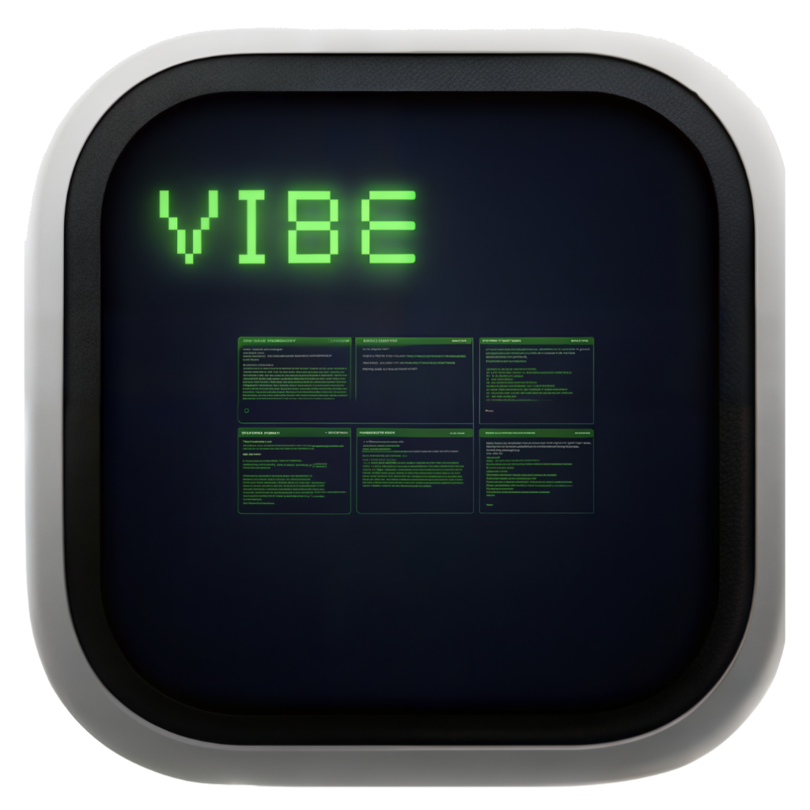

<h1 align="center">
  <br>
  Vibemux
</h1>

<p align="center">
  <video src="assets/demo.mp4" controls muted loop playsinline width="100%"></video>
</p>

<p align="center">
  为多动症友好的多任务工作流和 Vibe Coding 场景设计的键盘优先、跨平台 GUI 终端多路复用器。基于 Tauri、Rust、Svelte 和 xterm.js 构建。
</p>

<p align="center">
  
  
  
</p>

---

Vibemux 不是普通终端模拟器，也不是 tmux 的 GUI 包装。它面向多动症友好的终端工作流和 Vibe Coding 场景设计，适合同时运行多个 shell、dev server、测试、日志和编程 Agent。它把每个终端视为一个带名称、颜色、工作目录、进程状态和生命周期状态的 **session 任务**，让你一眼看到哪些任务在前台、哪些已经 detached、哪些需要处理。

## 功能特性

- **水平 Deck**，一个聚焦终端加多个重叠的旁路终端。
- **Detached session** 保持 PTY 运行，同时卸载完整 xterm 渲染实例。
- **Detach / Attach** 在 Deck 和 Detached 栏之间移动 session，不杀掉进程。
- **屏幕快照 + Replay**，attach 时恢复静态屏幕、回放缓冲输出，再接入实时输出流。
- **键盘优先 Navigation Mode**，prefix key 可配置，默认是 `Ctrl+B`。
- **全局命令面板**，macOS 使用 `Cmd+K`，Linux/Windows 使用 `Ctrl+K`，支持 session 搜索、快捷操作和 Ask AI。
- **Ask AI** 支持 OpenAI 兼容接口、模型拉取、流式回答、历史线程，以及可选的聚焦终端上下文。
- **GUI 创建 session**，支持 shell 或 command，包含名称、工作目录、shell/program、参数和颜色。
- **Titlebar 操作入口**，可新建 session、搜索、打开设置。
- **Pane 和 Detached card 操作**，支持 detach/attach、重命名、改颜色、关闭和强制 kill。
- **Deck 拖拽排序**，可以直观调整 hot session 顺序。
- **Busy 指示器和注意力徽章**，快速识别 running、active、done、failed 或 needs input 的 session。
- **首次启动引导**，选择导航键、默认 shell、终端主题/字体，以及可选 AI 配置。
- **Settings 面板**，配置终端字体、主题、布局、最大 hot session 数、prefix key 和 AI。
- **配置持久化**，TOML 格式、原子写入、配置损坏时自动回退并显示警告。
- **内置终端字体资源**，让构建产物中的字符和终端字形稳定渲染。
- **跨平台桌面应用**，支持 macOS、Linux、Windows。

## 键盘快捷键

默认 Navigation Mode prefix key 是 `Ctrl+B`。你可以在 **Settings -> Keys** 或首次启动引导中修改它。预设包含 `Ctrl+B`、`Ctrl+Space`、<code>Ctrl+&#96;</code>、`Ctrl+A`、`Cmd+Space`，也支持自定义组合键。

| 按键 | 操作 |
|------|------|
| 默认 `Ctrl+B` | 进入 / 退出 Navigation Mode |
| `Cmd+K` / `Ctrl+K` | 打开全局搜索和 Ask AI |
| `h` / `←` | 聚焦上一个 hot session |
| `l` / `→` | 聚焦下一个 hot session |
| `n` | 新建 session |
| `b` | Detach 当前 session |
| `j` / `↓` | 选择下一个 detached session |
| `k` / `↑` | 选择上一个 detached session |
| `Enter` | Attach 选中的 detached session |
| `r` | 重命名当前 session |
| `/` | 搜索 session |
| `?` | 显示快捷键帮助 |
| `x` | 优雅关闭当前 session |
| `X` | 强制 kill 当前 session |
| `Esc` | 退出 Navigation Mode |

在搜索面板中，直接输入会筛选 session 和已保存的 AI 线程。以 `#` 开头或选择 **Ask AI** 可进入聊天模式。

## 核心概念

### 热度模型（Thermal Model）

每个 session 都有一个热度状态：

| 状态 | 用户可见位置 | PTY 进程 | xterm 实例 |
|------|--------------|----------|------------|
| **Hot（热）** | Deck | 运行中 | 存活于 DOM |
| **Warm（温）** | Detached 栏 | 运行中 | 已销毁，输出缓冲 |
| **Cold（冷）** | Archive / 历史 | 已停止 | 无 |

**Detach** 会把 hot session 移出 Deck。进程继续运行，Vibemux 保存屏幕快照、销毁 xterm 实例，并继续缓冲输出。

**Attach** 会把 warm session 拉回 Deck。Vibemux 恢复已保存屏幕、回放缓冲输出、重新调整 PTY 尺寸、聚焦终端，然后接入实时输出。

### Deck（工作台）

Deck 是当前活跃 session 的水平区域。一个 session 处于 **focused（聚焦）** 状态并完整可交互，其余 session 保持压缩、重叠的旁路展示，让你不必给每个进程完整视口也能保留上下文。

### Detached 栏

Detached session 位于窗口底部的紧凑栏。每张卡片显示 session 名称、颜色、简短工作目录、busy 状态和注意力徽章。你可以点击卡片，或通过 Navigation Mode 把它 attach 回 Deck。

### 注意力状态（Attention State）

Vibemux 会监听 detached session 的输出和进程退出：

- `Active` 表示有新输出。
- `NeedsInput` 表示输出像是在等待输入，例如 `y/n`、`press enter`、`do you want`。
- `Failed` 表示输出匹配 `error`、`panic`、`fatal` 等失败模式，或进程以非零退出码结束。
- `Done` 表示进程以退出码 0 结束。

## 安装

从 [Releases](../../releases) 页面下载对应平台的安装包。

| 平台 | 文件 |
|------|------|
| macOS（Apple Silicon / Intel）| `.dmg` |
| Linux | `.AppImage` 或 `.deb` |
| Windows | `.msi` 或 `.exe` |

### macOS 未签名版本说明

第一版暂未进行 Apple Developer ID 签名和 notarization。macOS 首次启动时可能会拦截。

请先尝试：

1. 把 Vibemux 拖到 `/Applications`。
2. 按住 Control 右键点击 `Vibemux.app`。
3. 选择 **打开**。
4. 再次确认 **打开**。

如果 macOS 仍提示应用已损坏或无法打开，高级用户可以移除 quarantine 标记：

```bash
xattr -dr com.apple.quarantine /Applications/Vibemux.app
open /Applications/Vibemux.app
```

如果命令提示权限不足，再给同一个 `xattr` 命令加上 `sudo`。只建议对从 Vibemux 官方 Release 页面下载的安装包执行此操作。

## 从源码构建

**前置依赖：**

- [Rust](https://rustup.rs/) stable
- [Node.js](https://nodejs.org/) 18+
- 对应平台的 [Tauri 依赖](https://tauri.app/start/prerequisites/)

```bash
git clone https://github.com/yoko19191/vibemux
cd vibemux/apps/desktop
npm install
npm run tauri build
```

构建产物位于 `apps/desktop/src-tauri/target/release/bundle/`。

开发模式：

```bash
npm run tauri dev
```

## 配置文件

配置文件路径：

- **macOS**：`~/Library/Application Support/vibemux/config.toml`
- **Linux / Windows**：`~/.config/vibemux/config.toml`

示例：

```toml
[terminal]
font_family = "Menlo, Monaco, 'Courier New', monospace"
font_size = 14
line_height = 1.2
scrollback_lines = 10000
replay_buffer_lines = 10000
replay_buffer_mb = 20

[theme]
background = "#111111"
foreground = "#d9d4c7"
cursor = "#ff6b57"
selection = "#3b82f640"

[layout]
focused_pane_width = 0.6
preview_opacity = 0.8
animation_ms = 150
max_hot_sessions = 6
shelf_position = "bottom"

[keys]
prefix = "ctrl+b"

[shell]
default = "/bin/zsh"

[ai]
enabled = false
base_url = "https://api.openai.com"
api_key = ""
model = ""
system_prompt = "You are a helpful assistant inside Vibemux, a terminal multiplexer. Keep answers concise and practical."
```

所有字段均为可选，缺失时使用默认值。启动时若检测到配置文件损坏，Vibemux 会使用默认配置并在界面顶部显示警告横幅。

## 技术栈

- **桌面壳**：[Tauri](https://tauri.app/) v2
- **后端**：Rust + [Tokio](https://tokio.rs/) + [portable-pty](https://github.com/wez/wezterm/tree/main/pty)
- **前端**：[Svelte](https://svelte.dev/) 5 + TypeScript
- **终端渲染**：[xterm.js](https://xtermjs.org/) v6
- **AI 传输**：OpenAI 兼容的 `/v1/models` 和 `/v1/chat/completions` API

## 致谢

感谢 [Vibe99](https://github.com/NekoApocalypse/Vibe99) 为 Vibemux 带来的终端复用创意启发。

## License

MIT
